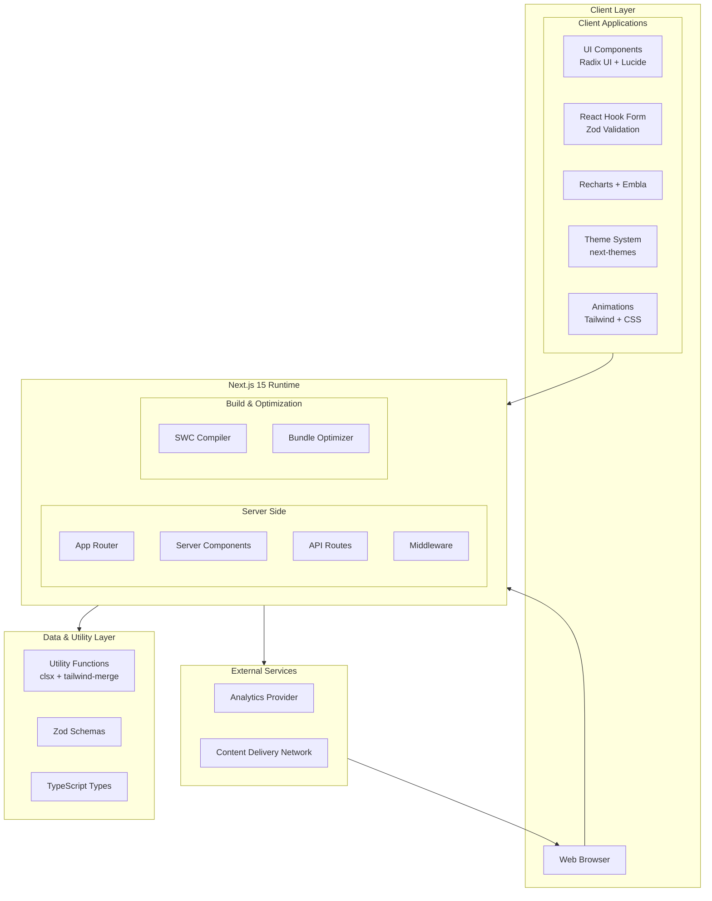
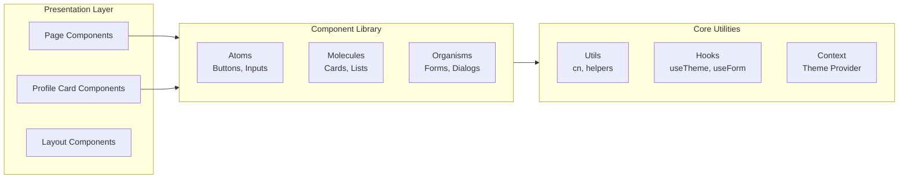
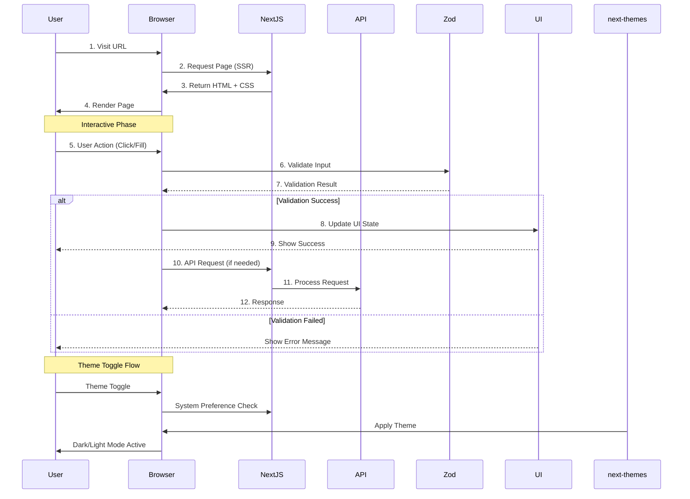

# Minimalist Profile Cards

<p align="center">
  
  
  
  
</p>

> **Minimalist Profile Cards** is a modern, responsive web application that showcases profile cards with a clean, elegant design. Built with **Next.js 15**, **React 19**, and **Tailwind CSS**, featuring a sleek UI with smooth animations and a fully customizable component system.

---

## Table of Contents

- [Features](#features)
- [Tech Stack](#tech-stack)
- [System Architecture](#system-architecture)
- [Getting Started](#getting-started)
- [Project Structure](#project-structure)
- [Configuration](#configuration)
- [Available Scripts](#available-scripts)
- [Project Stats](#project-stats)
- [Deployment](#deployment)
- [Contributing](#contributing)
- [License](#license)

---

## Features

### Core Features

- **Responsive Profile Cards** — Beautifully designed cards that adapt seamlessly to any screen size using a mobile-first approach
- **Modern UI/UX** — Clean, minimalist design with attention to detail, featuring subtle shadows and elegant spacing
- **Smooth Animations** — Fluid transitions and micro-interactions using **Tailwind CSS** and custom CSS animations
- **Component-Based Architecture** — Reusable and modular component structure following atomic design principles
- **Dark/Light Theme Support** — Built with **next-themes** for seamless, system-preference-aware theme switching
- **Accessibility First** — WCAG 2.1 compliant with proper ARIA labels and keyboard navigation

### UI Components (Radix UI)

The project includes **18+** production-ready UI components built on Radix UI primitives:

| Component | Description |
|-----------|-------------|
| `Accordion` | Collapsible content sections |
| `Alert Dialog` | Modal confirmation dialogs |
| `Avatar` | User profile images with fallback |
| `Checkbox` | Accessible form checkboxes |
| `Collapsible` | Show/hide content containers |
| `Context Menu` | Right-click action menus |
| `Dialog` | Modal overlays and popups |
| `Dropdown Menu` | Nested menu navigation |
| `Hover Card` | Preview cards on hover |
| `Navigation Menu` | Multi-level navigation |
| `Popover` | Floating content panels |
| `Progress` | Linear progress indicators |
| `Radio Group` | Mutually exclusive options |
| `Select` | Custom dropdown selects |
| `Slider` | Range input controls |
| `Switch` | Toggle on/off controls |
| `Tabs` | Tabbed content sections |
| `Toast` | Notification toasts |
| `Tooltip` | Hover information tips |

### Additional Features

- **Analytics Ready** — Prepared for **@vercel/analytics** integration out of the box
- **Form Handling** — **react-hook-form** with **Zod** schema validation for robust form management
- **Data Visualization** — **Recharts** for charts, graphs, and data representation
- **Date Handling** — **date-fns** and **react-day-picker** for calendar functionality
- **Command Menu** — **cmdk** for fast keyboard-driven navigation via command palette
- **Carousel** — **embla-carousel-react** for swipeable, touch-friendly content displays

---

## Tech Stack

### 🔹 Framework & Runtime

| Technology | Version | Purpose |
|------------|---------|---------|
| **Next.js** | `15.2.4` | React framework with App Router for production |
| **React** | `19.x` | UI library for building interactive interfaces |
| **TypeScript** | `5.x` | Type safety and better developer experience |

### 🔹 Styling & UI

| Technology | Version | Purpose |
|------------|---------|---------|
| **Tailwind CSS** | `3.4.17` | Utility-first CSS framework |
| **Tailwind CSS Animate** | `1.0.7` | Animation utilities for Tailwind |
| **Radix UI** | Latest | Headless, accessible UI component primitives |
| **Lucide React** | `0.454.0` | Beautiful, consistent icon library |
| **Geist** | `1.3.1` | Modern sans-serif font family |

### 🔹 Data & Forms

| Technology | Version | Purpose |
|------------|---------|---------|
| **React Hook Form** | `7.54.1` | Performant form validation |
| **Zod** | `3.24.1` | TypeScript-first schema validation |
| **@hookform/resolvers** | `3.9.1` | Connect Zod with React Hook Form |

### 🔹 Utilities

| Technology | Version | Purpose |
|------------|---------|---------|
| **clsx** | `2.1.1` | Conditional classNames utility |
| **tailwind-merge** | `2.5.5` | Merge Tailwind classes without conflicts |
| **date-fns** | `4.1.0` | Lightweight date manipulation |
| **cmdk** | `1.0.4` | Fast command palette component |
| **sonner** | `1.7.1` | Toast notification system |
| **vaul** | `0.9.6` | Drawer/sheet component |

### 🔹 Charts & Visualization

| Technology | Version | Purpose |
|------------|---------|---------|
| **Recharts** | `2.15.0` | Composable charting library |
| **embla-carousel-react** | `8.5.1` | Carousel component with gesture support |

### 🔹 Theme & State

| Technology | Version | Purpose |
|------------|---------|---------|
| **next-themes** | `0.4.4` | Theme management with system detection |
| **react-resizable-panels** | `2.1.7` | Resizable panel layouts |

---

## System Architecture

### 🔸 High-Level Architecture



### 🔸 Component Architecture



### 🔸 Data Flow Architecture



### 🔸 Deployment Architecture

```mermaid
flowchart TB
    subgraph Development["Development"]
        Local[Local Dev Server]
        HMR[Hot Module Reload]
    end
    
    subgraph Build["Build Process"]
        Build[Build Command]
        Lint[ESLint Check]
        Type[Type Check]
        Optimize[Bundle Optimize]
    end
    
    subgraph Production["Production"]
        Vercel[Vercel Platform]
        Edge[Edge Network]
        Cache[CDN Cache]
    end
    
    Development --> Build
    Build --> Lint
    Build --> Type
    Lint --> Optimize
    Type --> Optimize
    Optimize --> Production
    Production --> Edge
    Edge --> Cache
```

---

## Getting Started

### ✅ Prerequisites

Before you begin, ensure you have the following installed:

| Requirement | Version | Description |
|-------------|---------|-------------|
| **Node.js** | `18.x` or later | JavaScript runtime |
| **npm** | `9.x` or later | Package manager |
| **Git** | Latest | Version control system |

> **Tip:** Run `node --version` and `npm --version` in your terminal to verify installations.

### 📦 Installation

Follow these steps to set up the project locally:

```bash
# 1. Clone the repository
git clone https://github.com/girishlade111/minimalist-profile-cards.git

# 2. Navigate to the project directory
cd minimalist-profile-cards

# 3. Install dependencies
npm install

# 4. Start the development server
npm run dev
```

### 🌐 Access the Application

Open your browser and navigate to:

```
http://localhost:3000
```

---

## Project Structure

```
minimalist-profile-cards/
│
├── .next/                      # Next.js build output (generated)
│
├── app/                        # Next.js 15 App Router
│   ├── layout.tsx             # Root layout with providers
│   ├── page.tsx              # Home page
│   └── globals.css           # Global styles
│
├── components/                 # React components
│   ├── ui/                   # Reusable UI components
│   │   ├── accordion.tsx
│   │   ├── avatar.tsx
│   │   ├── button.tsx
│   │   ├── card.tsx
│   │   ├── dialog.tsx
│   │   └── ...
│   └── profile-card.tsx     # Profile card component
│
├── lib/                       # Utility functions
│   ├── utils.ts             # cn() helper function
│   └── hooks.ts             # Custom React hooks
│
├── public/                   # Static assets
│   ├── images/              # Image files
│   └── fonts/               # Font files
│
├── styles/                  # Global styles
│   └── globals.css          # CSS variables & base styles
│
├── package.json             # Dependencies & scripts
├── tailwind.config.ts       # Tailwind CSS configuration
├── tsconfig.json            # TypeScript configuration
├── postcss.config.mjs       # PostCSS configuration
├── next.config.mjs          # Next.js configuration
└── README.md               # This file
```

---

## Configuration

### 🔧 tailwind.config.ts

The Tailwind configuration includes:

```typescript
// Key configurations:
{
  darkMode: ["class"],           // Enable class-based dark mode
  content: ["./app/**/*.{js,ts,jsx,tsx}"],  // Content paths
  theme: {
    extend: {
      colors: {...},             // Custom color palette
      keyframes: {...},          // Animation keyframes
      animation: {...},          // Custom animations
    },
  },
  plugins: [require("tailwindcss-animate")],  // Animation plugin
}
```

**Features:**
- ✅ Custom color palette with semantic colors
- ✅ Animation keyframes for smooth transitions
- ✅ Component patterns for consistency
- ✅ Dark mode support with system preference detection

### 🔧 next.config.mjs

The Next.js configuration includes:

```javascript
{
  reactStrictMode: true,       // Enable React strict mode
  images: {
    domains: ['example.com'],  // Image optimization config
  },
  // Bundle optimization settings
}
```

**Features:**
- ✅ React strict mode for better development
- ✅ Image optimization and caching
- ✅ Bundle size optimization
- ✅ SWC compiler for fast builds

### 🔧 tsconfig.json

The TypeScript configuration includes:

```json
{
  "compilerOptions": {
    "target": "ES2017",
    "lib": ["dom", "dom.iterable", "esnext"],
    "allowJs": true,
    "strict": true,
    "noEmit": true,
    "esModuleInterop": true,
    "module": "esnext",
    "moduleResolution": "bundler",
    "resolveJsonModule": true,
    "isolatedModules": true,
    "jsx": "preserve",
    "incremental": true,
    "plugins": [{ "name": "next" }],
    "paths": {
      "@/*": ["./*"]           // Path aliases
    }
  }
}
```

**Features:**
- ✅ Path aliases for cleaner imports (`@/components`)
- ✅ Strict type checking enabled
- ✅ ESNext module resolution
- ✅ Incremental compilation support

---

## Available Scripts

| Command | Description | Usage |
|---------|-------------|-------|
| `npm run dev` | Start the development server with HMR | `npm run dev` |
| `npm run build` | Build for production | `npm run build` |
| `npm run start` | Start the production server | `npm run start` |
| `npm run lint` | Run ESLint for code quality | `npm run lint` |

### Usage Examples

```bash
# Development mode (default http://localhost:3000)
npm run dev

# Build for production
npm run build

# Start production server (after build)
npm run start

# Check code quality
npm run lint
```

---

## Project Stats

| Metric | Value |
|--------|-------|
| **Total Dependencies** | `63` packages |
| **Production Dependencies** | `56` packages |
| **Dev Dependencies** | `7` packages |
| **UI Components** | `18+` Radix components |
| **Framework** | Next.js `15.2.4` |
| **React Version** | `19.x` |
| **TypeScript Version** | `5.x` |
| **Tailwind Version** | `3.4.17` |

---

## Deployment

### 🚀 Build for Production

```bash
# Create optimized production build
npm run build

# Start the production server
npm run start
```

### 🔐 Environment Variables

Create a `.env.local` file for local development:

```env
# Analytics (optional)
NEXT_PUBLIC_ANALYTICS_ID=your_analytics_id
```

### ☁️ Deployment Platforms

The project is optimized for deployment on:

- **Vercel** (Recommended) — Zero-config deployment with automatic optimizations
- **Netlify** — Static and serverless deployment
- **Docker** — Containerized deployment
- **Self-hosted** — Custom server deployment

---

## Contributing

Contributions are welcome! Here's how you can help:

1. **Fork** the repository
2. **Create** a feature branch (`git checkout -b feature/amazing-feature`)
3. **Commit** your changes (`git commit -m 'Add amazing feature'`)
4. **Push** to the branch (`git push origin feature/amazing-feature`)
5. **Open** a Pull Request

Please read [CONTRIBUTING.md](CONTRIBUTING.md) for detailed guidelines.

---

## License

This project is licensed under the **MIT License** — see the [LICENSE](LICENSE) file for details.

---

## Support

For support, please:

- **Open an issue** in the GitHub repository
- **Check existing issues** before creating a new one
- **Provide detailed information** including steps to reproduce

---

<p align="center">
  <strong>Built with ❤️ using Next.js, React, and Tailwind CSS</strong>
</p>