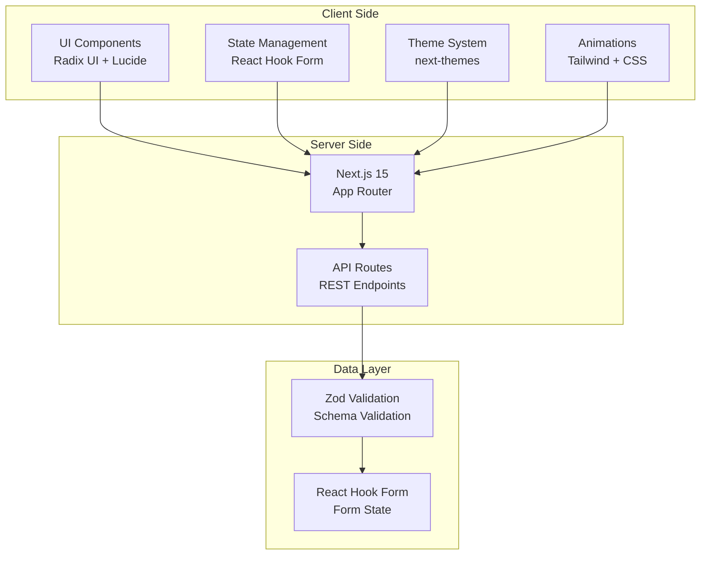
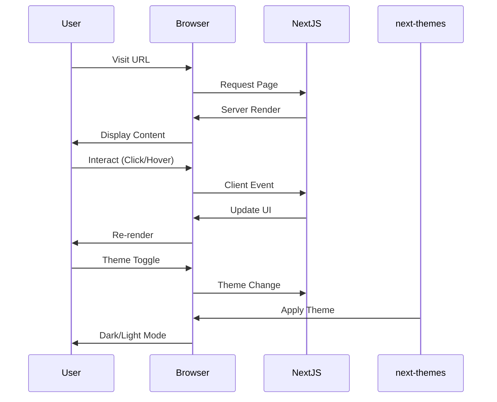

# Minimalist Profile Cards

A modern, responsive web application showcasing profile cards with a clean and elegant design.

[](https://nextjs.org)
[](https://www.typescriptlang.org)
[](https://tailwindcss.com)

---

## Overview

> **Minimalist Profile Cards** is a modern, responsive web application that showcases profile cards in a clean and elegant design. Built with Next.js 15 and React 19, it features a sleek UI with smooth animations and a fully customizable component system.

---

## Features

### Core Features
- **Responsive Profile Cards** - Beautifully designed cards that adapt to any screen size
- **Modern UI/UX** - Clean, minimalist design with attention to detail
- **Smooth Animations** - Fluid transitions and micro-interactions using CSS and Tailwind
- **Component-Based Architecture** - Reusable and modular component structure
- **Dark/Light Theme Support** - Built with next-themes for seamless theme switching

### UI Components (Radix UI)
- Accordion
- Alert Dialog
- Avatar
- Checkbox
- Collapsible
- Context Menu
- Dialog
- Dropdown Menu
- Hover Card
- Navigation Menu
- Popover
- Progress
- Radio Group
- Select
- Slider
- Switch
- Tabs
- Toast
- Tooltip

### Additional Features
- **Analytics Ready** - Prepared for analytics integration
- **Form Handling** - react-hook-form with Zod validation
- **Data Visualization** - Recharts for charts and graphs
- **Date Handling** - date-fns and react-day-picker
- **Command Menu** - cmdk for command palette
- **Carousel** - embla-carousel-react for swipeable content

---

## Tech Stack

### Framework & Runtime
- **Next.js** 15.2.4 - React framework for production
- **React** 19.x - UI library
- **TypeScript** 5.x - Type safety

### Styling & UI
- **Tailwind CSS** 3.4.17 - Utility-first CSS framework
- **Tailwind CSS Animate** 1.0.7 - Animation utilities
- **Radix UI** - Headless UI components
- **Lucide React** - Icon library
- **Geist** - Font family

### Data & Forms
- **React Hook Form** - Form validation
- **Zod** - Schema validation
- **@hookform/resolvers** - Form resolvers

### Utilities
- **clsx** - Conditional classNames
- **tailwind-merge** - Tailwind class merging
- **date-fns** - Date utilities
- **cmdk** - Command palette
- **sonner** - Toast notifications
- **vaul** - Drawer component

### Charts & Visualization
- **Recharts** - Composable charting library
- **embla-carousel-react** - Carousel component

### Theme & State
- **next-themes** - Theme management
- **react-resizable-panels** - Resizable panels

---

## System Architecture





---

## Getting Started

### Prerequisites

- **Node.js** 18.x or later
- **npm** 9.x or later
- **Git** for version control

### Installation

```bash
# Clone the repository
git clone https://github.com/girishlade111/minimalist-profile-cards.git
cd minimalist-profile-cards

# Install dependencies
npm install

# Start the development server
npm run dev
```

Open [http://localhost:3000](http://localhost:3000) in your browser.

---

## Available Scripts

| Command | Description |
|---------|-------------|
| `npm run dev` | Start the development server |
| `npm run build` | Build for production |
| `npm run start` | Start the production server |
| `npm run lint` | Run ESLint for code quality |

---

## Project Structure

```
minimalist-profile-cards/
├── .next/                  # Next.js build output
├── app/                    # Next.js App Router
├── components/             # React components
├── lib/                    # Utility functions
├── public/                # Static assets
├── styles/                # Global styles
├── package.json           # Dependencies
├── tailwind.config.ts    # Tailwind configuration
├── tsconfig.json         # TypeScript config
├── postcss.config.mjs   # PostCSS config
├── next.config.mjs      # Next.js config
└── README.md           # This file
```

---

## Configuration

### tailwind.config.ts
- Custom color palette
- Animation keyframes
- Component patterns
- Dark mode support

### next.config.mjs
- React strict mode
- Image optimization
- Bundle optimization

### tsconfig.json
- Path aliases
- Type checking options
- Module resolution

---

## Deployment

### Build for Production

```bash
npm run build
npm run start
```

### Environment Variables

Create a `.env.local` file for local development:

```env
NEXT_PUBLIC_ANALYTICS_ID=your_analytics_id
```

---

## Project Stats

| Metric | Value |
|--------|-------|
| **Total Dependencies** | 40+ |
| **Dev Dependencies** | 7 |
| **UI Components** | 18+ |
| **Framework** | Next.js 15.2.4 |
| **React Version** | 19.x |

---

## License

MIT License

---

## Contributing

Contributions are welcome! Please feel free to submit a Pull Request.

---

## Support

For support, please open an issue in the GitHub repository.

---

*Built with Next.js, React, and Tailwind CSS*