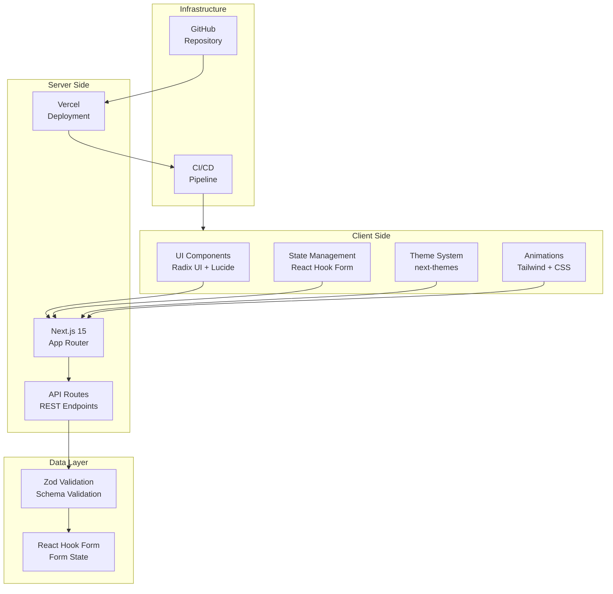
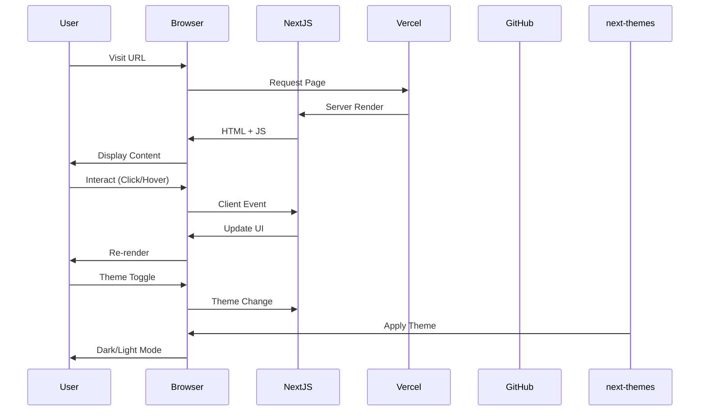

# Minimalist Profile Cards

*Automatically synced with your [v0.app](https://v0.app) deployments*

[](https://vercel.com/gileb64375-5584s-projects/v0-minimalist-profile-cards)
[](https://v0.app/chat/projects/I973jQrZ5eB)
[](https://nextjs.org)
[](https://www.typescriptlang.org)
[](https://tailwindcss.com)

---

## Overview

> **Minimalist Profile Cards** is a modern, responsive web application that showcases profile cards in a clean and elegant design. Built with the latest Next.js 15 and React 19, it features a sleek UI with smooth animations and a fully customizable component system.

This repository stays in sync with your deployed chats on [v0.app](https://v0.app). Any changes you make to your deployed app will be automatically pushed to this repository.

---

## Features

### Core Features
- **Responsive Profile Cards** - Beautifully designed cards that adapt to any screen size
- **Modern UI/UX** - Clean, minimalist design with attention to detail
- **Smooth Animations** - Fluid transitions and micro-interactions using CSS and Tailwind
- **Component-Based Architecture** - Reusable and modular component structure
- **Dark/Light Theme Support** - Built with next-themes for seamless theme switching

### UI Components (Radix UI)
- Accordion
- Alert Dialog
- Avatar
- Checkbox
- Collapsible
- Context Menu
- Dialog
- Dropdown Menu
- Hover Card
- Navigation Menu
- Popover
- Progress
- Radio Group
- Select
- Slider
- Switch
- Tabs
- Toast
- Tooltip
- And more...

### Additional Features
- **Analytics Integration** - @vercel/analytics for tracking
- **Form Handling** - react-hook-form with Zod validation
- **Data Visualization** - Recharts for charts and graphs
- **Date Handling** - date-fns and react-day-picker
- **Command Menu** - cmdk for command palette
- **Carousel** - embla-carousel-react for swipeable content
- **Input OTPs** - input-otp for one-time passwords

---

## Tech Stack

### Framework & Runtime
- **Next.js** 15.2.4 - React framework for production
- **React** 19.2.5 - UI library
- **TypeScript** 5.x - Type safety

### Styling & UI
- **Tailwind CSS** 3.4.17 - Utility-first CSS framework
- **Tailwind CSS Animate** 1.0.7 - Animation utilities
- **Radix UI** - Headless UI components
- **Lucide React** 0.454.0 - Icon library
- **Geist** 1.3.1 - Font family

### Data & Forms
- **React Hook Form** 7.54.1 - Form validation
- **Zod** 3.24.1 - Schema validation
- **@hookform/resolvers** 3.9.1 - Form resolvers

### Utilities
- **clsx** 2.1.1 - Conditional classNames
- **tailwind-merge** 2.5.5 - Tailwind class merging
- **date-fns** 4.1.0 - Date utilities
- **cmdk** 1.0.4 - Command palette
- **sonner** 1.7.1 - Toast notifications
- **vaul** 0.9.6 - Drawer component

### Charts & Visualization
- **Recharts** 2.15.0 - Composable charting library
- **embla-carousel-react** 8.5.1 - Carousel component

### Theme & State
- **next-themes** 0.4.4 - Theme management
- **react-resizable-panels** 2.1.7 - Resizable panels

### Dev Tools
- **PostCSS** 8.5 - CSS transformations
- **Autoprefixer** 10.4.20 - Vendor prefixing

---

## System Architecture





---

## Getting Started

### Prerequisites

Before you begin, ensure you have the following installed:

- **Node.js** 18.x or later
- **npm** 9.x or later
- **Git** for version control

### Installation

1. **Clone the repository**

```bash
git clone https://github.com/girishlade111/minimalist-profile-cards.git
cd minimalist-profile-cards
```

2. **Install dependencies**

```bash
npm install
# or with legacy-peer-deps if needed
npm install --legacy-peer-deps
```

3. **Start the development server**

```bash
npm run dev
```

4. **Open the application**

Navigate to [http://localhost:3000](http://localhost:3000) in your browser.

---

## Available Scripts

| Command | Description |
|---------|-------------|
| `npm run dev` | Start the development server |
| `npm run build` | Build for production |
| `npm run start` | Start the production server |
| `npm run lint` | Run ESLint for code quality |

---

## Configuration Files

### Project Structure

```
minimalist-profile-cards/
├── .next/                  # Next.js build output
├── app/                    # Next.js App Router
├── components/             # React components
├── lib/                    # Utility functions
├── public/                # Static assets
├── styles/                # Global styles
├── package.json           # Dependencies
├── tailwind.config.ts    # Tailwind configuration
├── tsconfig.json         # TypeScript config
├── postcss.config.mjs   # PostCSS config
├── next.config.mjs      # Next.js config
└── README.md           # This file
```

### Key Configurations

#### tailwind.config.ts
- Custom color palette
- Animation keyframes
- Component patterns
- Dark mode support

#### next.config.mjs
- React strict mode
- Image optimization
- Bundle optimization

#### tsconfig.json
- Path aliases
- Type checking options
- Module resolution

---

## Deployment

### Vercel Deployment

Your project is live at:

**[https://vercel.com/gileb64375-5584s-projects/v0-minimalist-profile-cards](https://vercel.com/gileb64375-5584s-projects/v0-minimalist-profile-cards)**

### Manual Deployment

1. **Build the project**

```bash
npm run build
```

2. **Start the server**

```bash
npm run start
```

### Environment Variables

Create a `.env.local` file for local development:

```env
NEXT_PUBLIC_ANALYTICS_ID=your_analytics_id
```

---

## Project Stats

| Metric | Value |
|--------|-------|
| **Total Dependencies** | 41+ |
| **Dev Dependencies** | 7 |
| **UI Components** | 20+ |
| **Last Updated** | April 2026 |
| **Framework** | Next.js 15.2.4 |
| **React Version** | 19.x |

---

## How It Works

1. **Create and modify** your project using [v0.app](https://v0.app)
2. **Deploy** your chats from the v0 interface
3. **Changes** are automatically pushed to this repository
4. **Vercel** deploys the latest version from this repository

---

## Continue Building

Continue building your app on:

**[https://v0.app/chat/projects/I973jQrZ5eB](https://v0.app/chat/projects/I973jQrZ5eB)**

---

## License

This project is licensed under the MIT License.

---

## Contributing

Contributions are welcome! Please feel free to submit a Pull Request.

---

## Support

For support, please open an issue in the GitHub repository.

---

*Built with 💜 using Next.js, React, and Tailwind CSS*